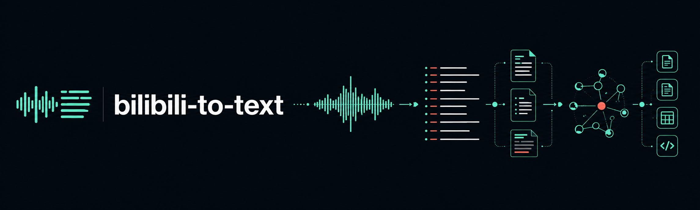
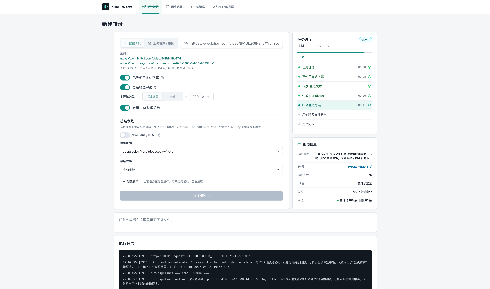
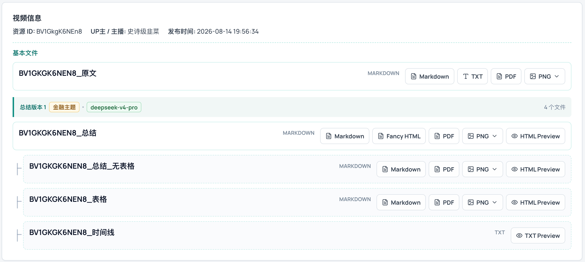
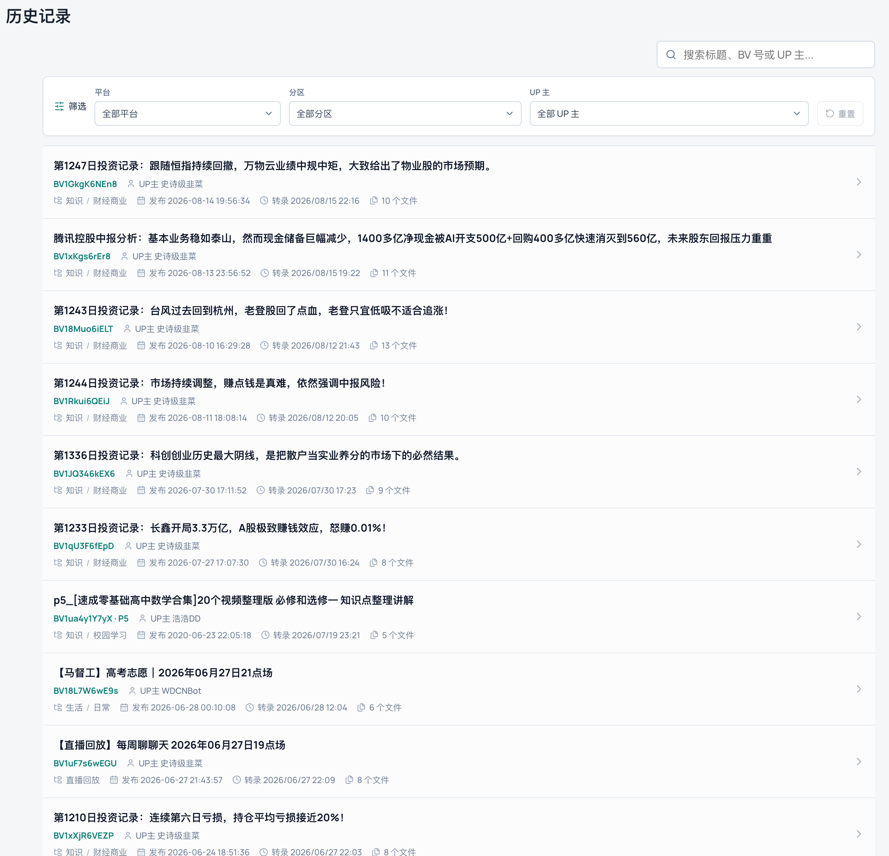
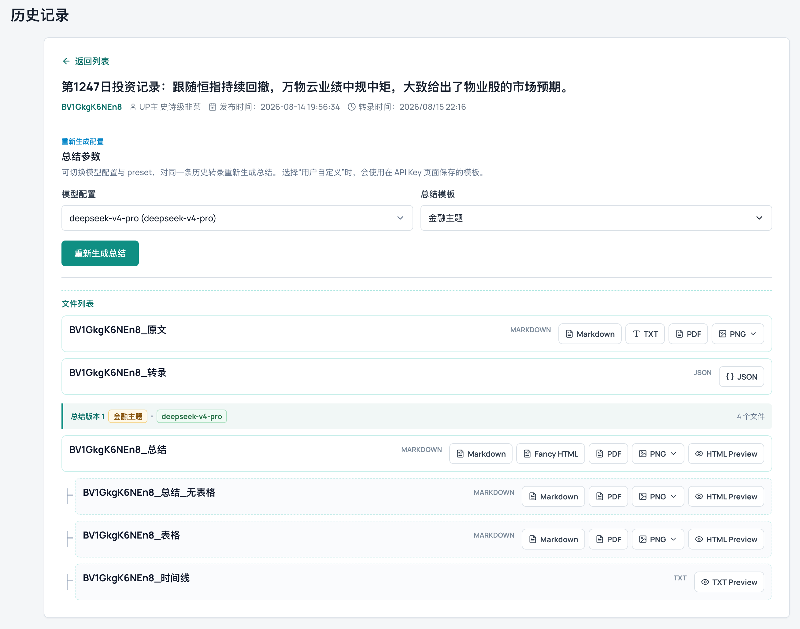
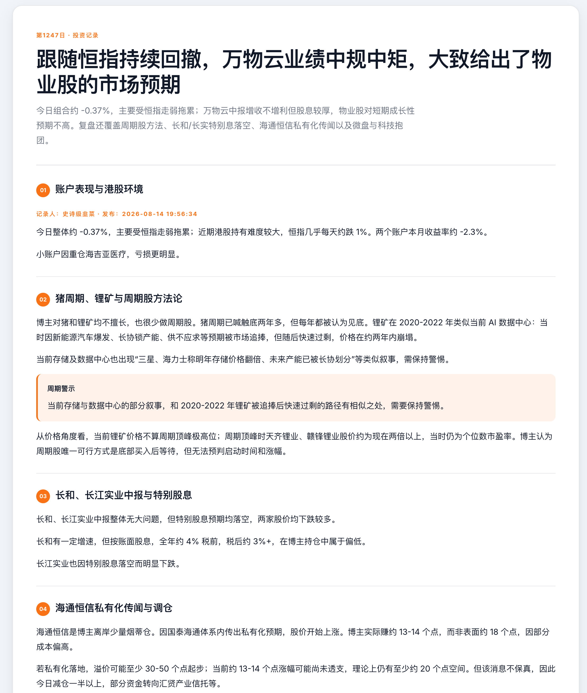
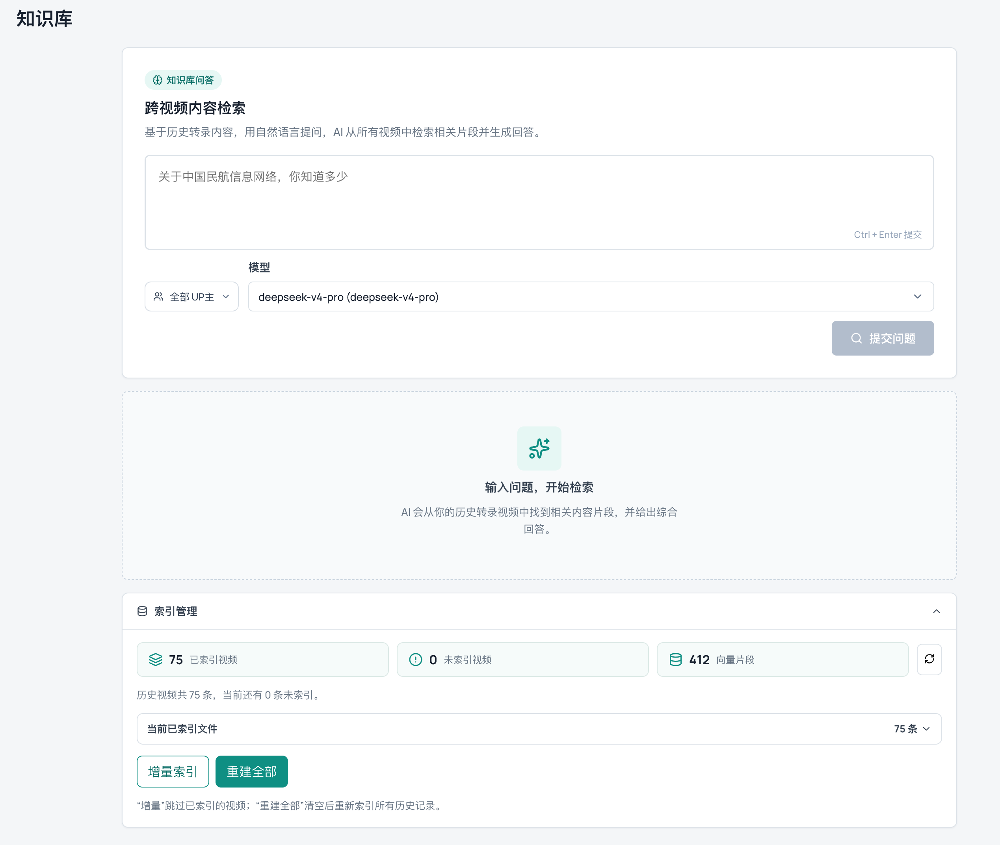
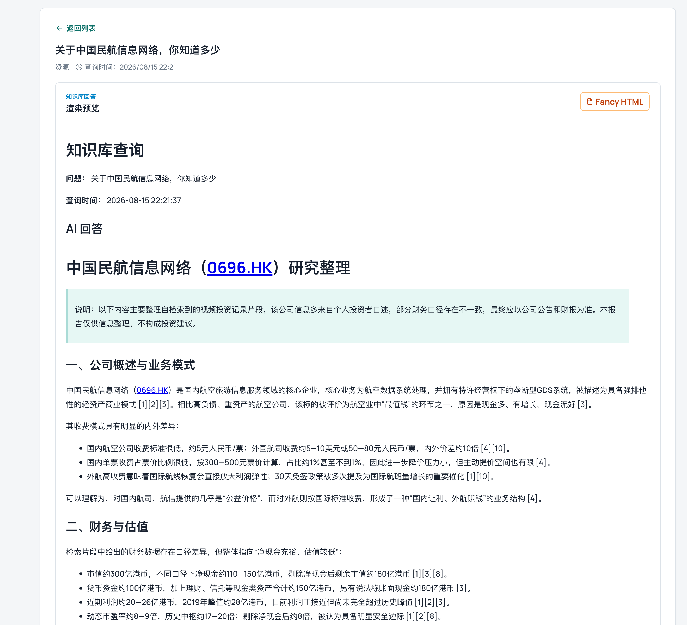
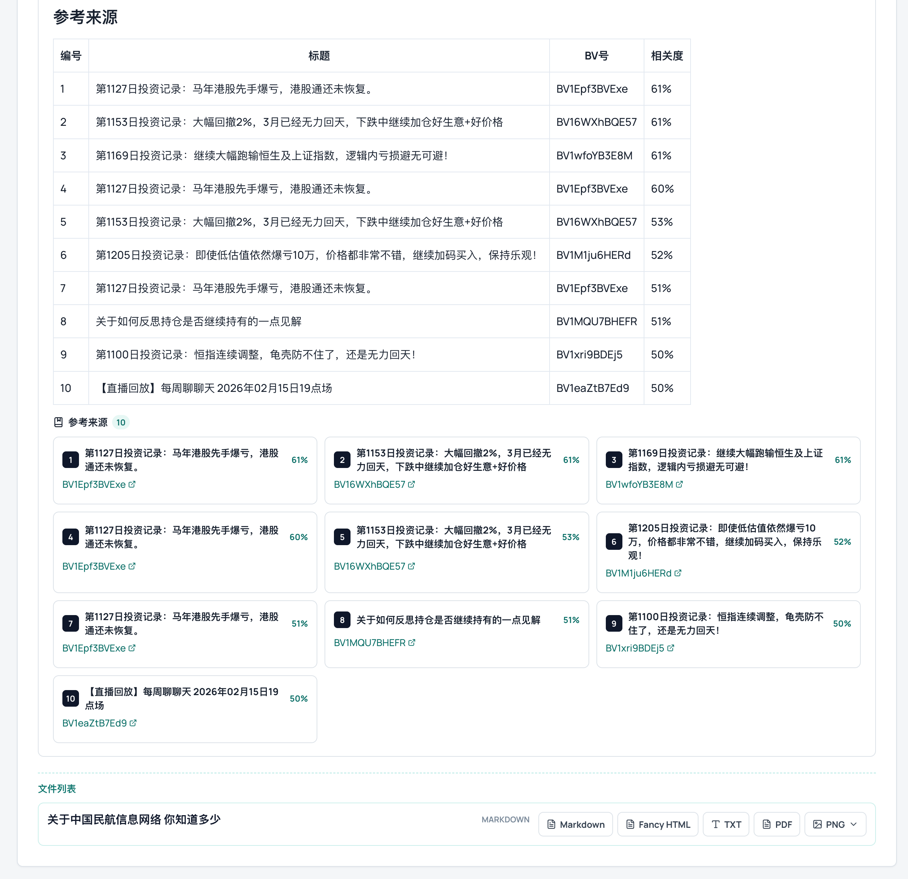

<p align="center">
  
</p>

<p align="center">
  支持 Bilibili、小宇宙与喜马拉雅，自动完成媒体获取、语音转录、LLM 结构化总结与多格式导出。
</p>

<p align="center">
  <a href="https://github.com/KKKZOZ/bilibili2text/stargazers"></a>
  <a href="https://github.com/KKKZOZ/bilibili2text/commits/main"></a>
  
</p>

<p align="center">
  
  
  
  
</p>

<p align="center">
  <a href="#功能概览">功能概览</a> ·
  <a href="#界面预览">界面预览</a> ·
  <a href="#快速开始">快速开始</a> ·
  <a href="#使用方式">使用方式</a> ·
  <a href="#部署">部署</a> ·
  <a href="#配置参考">配置参考</a> ·
  <a href="#深入阅读">深入阅读</a>
</p>

---

`bilibili-to-text` 是一个面向长内容的自动化处理工具。它将视频或播客转换为带上下文的 Markdown 文稿，并进一步生成结构化总结、表格、时间线、Fancy HTML 与知识库索引。既可以通过 Web UI 管理完整工作流，也可以使用 CLI 或监控服务批量运行。

> [!TIP]
> **在线体验：** [b2t.kkkzoz.top:27676](http://b2t.kkkzoz.top:27676)
>
> Open Public 模式使用访问者自己的 API Key；Key 只保存在当前浏览器本地，并仅在任务请求或连接测试时发送给服务端。

## 功能概览

| 能力 | 说明 |
| --- | --- |
| 多平台输入 | 解析 Bilibili、小宇宙、喜马拉雅链接；Web UI 支持上传常见音频与视频文件 |
| Bilibili 评论 | 抓取视频评论（含回复楼、点赞数、UP 主标识），导出为 JSON 与 Markdown，并可作为总结上下文 |
| 语音转录 | 优先使用 Bilibili 原生字幕，并支持 Groq Whisper、阿里云 DashScope / Qwen ASR、火山引擎 ASR |
| LLM 总结 | 通过 LiteLLM 兼容接口连接不同模型，支持总结模板、模型配置、评论观点与 UP 主术语上下文 |
| 内容导出 | 生成 Markdown、TXT、PDF、PNG、HTML、表格和时间线等派生产物 |
| 历史与检索 | 在 Web UI 中按平台、分区、UP 主筛选转录记录，并使用可选 RAG 知识库跨视频检索和问答 |
| 任务管理 | 有界任务队列、SSE 实时进度推送、协程式取消，支持后台并发处理多个转录任务 |
| 存储后端 | 支持本地目录、MinIO 与阿里云 OSS |
| 自动化 | 监控指定 Bilibili UP 主的新视频，自动转录总结，并通过飞书机器人发送通知 |
| 开放服务 | Open Public 模式允许访问者使用自己的 API Key；临时上传不会进入共享历史记录 |

### 处理流程

```text
视频 / 播客 / 本地文件
        ↓
字幕优先获取 · 音频下载 · ASR 转录 · 评论抓取
        ↓
Markdown 原文 · 评论 · 结构化元数据
        ↓
LLM 总结 · 表格 · 时间线 · Fancy HTML
        ↓
历史记录 · 多格式导出 · RAG 知识检索
```

> [!NOTE]
> 当前主要在 Linux 和 macOS 上验证 Web UI、RAG、Open Public、UP 主监控和飞书通知。CLI 与 Docker/Nginx 部署脚本仍属于实验性使用路径。

## 界面预览

<p align="center">
  
  <br />
  <sub>从链接或本地文件创建任务，并统一配置字幕、评论、总结模型与模板。</sub>
</p>

<table>
  <tr>
    <td width="50%" align="center">
      
      <br />
      <sub>转录产物与多格式导出</sub>
    </td>
    <td width="50%" align="center">
      
      <br />
      <sub>历史记录、筛选与任务状态</sub>
    </td>
  </tr>
  <tr>
    <td width="50%" align="center">
      
      <br />
      <sub>视频信息与总结版本管理</sub>
    </td>
    <td width="50%" align="center">
      
      <br />
      <sub>可独立分享的 Fancy HTML</sub>
    </td>
  </tr>
</table>

<details>
<summary><strong>查看知识库检索与问答效果</strong></summary>

<p align="center">
  
  
  
</p>

</details>

## 快速开始

### 1. 准备环境

| 依赖 | 用途 | 是否必需 |
| --- | --- | --- |
| Python 3.12+ | 核心处理流程与 FastAPI 后端 | 是 |
| [uv](https://docs.astral.sh/uv/) | Python 环境与依赖管理 | 是 |
| `ffmpeg` | 音视频处理 | 是 |
| [Bun](https://bun.sh/) | Web UI 前端开发与构建 | 使用 Web UI 时 |
| `pandoc` | Markdown 格式转换 | 导出相关格式时 |
| Playwright Chromium | 渲染 PDF 与 PNG | 导出 PDF/PNG 时 |
| Docker | Nginx 静态前端部署 | 可选 |

安装常用系统依赖：

```bash
# macOS
brew install ffmpeg pandoc

# Debian / Ubuntu
sudo apt install ffmpeg pandoc
```

### 2. 安装项目

```bash
git clone https://github.com/KKKZOZ/bilibili2text.git bilibili-to-text
cd bilibili-to-text

uv sync --all-extras
cp config.toml.example config.toml

cd web-ui/frontend
bun install
cd ../..
```

需要导出 PDF 或 PNG 时，再安装浏览器运行时：

```bash
uv run playwright install chromium
```

### 3. 配置服务

打开 `config.toml`，至少完成以下两项：

1. 在 `[stt]` 中选择并配置一个语音识别 profile。
2. 在 `[summarize]` 中选择并配置一个 LLM profile；不需要总结时可以在任务中关闭。

Groq ASR 可以直接使用本地存储；Qwen / DashScope 与火山引擎文件转录需要 MinIO 或阿里云 OSS 提供可访问的临时 URL。完整字段和可选 profile 已写在 [`config.toml.example`](./config.toml.example) 中。

<details>
<summary><strong>最小示例：本地存储 + Groq ASR + 阿里云百炼总结</strong></summary>

```toml
[storage]
backend = "local"

[stt]
profile = "groq-main"

[stt.profiles.groq-main]
provider = "groq"
language = "zh"
storage_profile = "local"
groq_api_key = "your-groq-api-key"
groq_model = "whisper-large-v3-turbo"
groq_base_url = "https://api.groq.com/openai/v1"

[summarize]
profile = "bailian-main"
preset = "timeline_merge"
presets_file = "summary_presets.toml"

[summarize.profiles.bailian-main]
provider = "bailian"
model = "qwen3-max"
api_base = "https://dashscope.aliyuncs.com/compatible-mode/v1"
api_key = "your-dashscope-api-key"
```

Groq API Key 可从 [Groq Console](https://console.groq.com/keys) 获取；DashScope API Key 可从 [阿里云百炼控制台](https://bailian.console.aliyun.com/) 获取。

</details>

### 4. 启动 Web UI

分别启动后端和前端：

```bash
# 终端 1：FastAPI，默认端口 8000
uv run uvicorn backend.main:app \
  --app-dir web-ui \
  --host 0.0.0.0 \
  --port 8000 \
  --reload
```

```bash
# 终端 2：Vue / Vite，默认端口 6010
cd web-ui/frontend
bun run dev
```

打开 [http://127.0.0.1:6010](http://127.0.0.1:6010)。如后端使用其他端口：

```bash
cd web-ui/frontend
bun run dev --backend-port 8001
```

## 使用方式

### Web UI

Web UI 提供新建转录、实时进度、视频元数据、历史记录（支持按平台、分区、UP 主筛选）、评论查看、总结版本管理、产物转换、API Key 配置与知识库问答等完整工作流。允许浏览器通知后，任务完成时可以从系统通知直接返回对应任务详情。

### CLI

处理单个链接：

```bash
uv run b2t "https://www.bilibili.com/video/BVxxxxxxxxxx"
```

指定输出目录、总结模板和模型配置：

```bash
uv run b2t "https://www.bilibili.com/video/BVxxxxxxxxxx" \
  --config config.toml \
  --output ./transcriptions \
  --summary-preset timeline_merge \
  --summary-profile bailian-main
```

跳过 LLM 总结：

```bash
uv run b2t "https://www.bilibili.com/video/BVxxxxxxxxxx" --no-summary
```

查看全部 CLI 参数：

```bash
uv run b2t --help
```

### UP 主监控

在 `config.toml` 的 `[monitor]` 和 `[[monitor.creators]]` 中配置监控对象，并在 `[feishu]` 中选择 Webhook 或自建应用通知方式：

```bash
uv run b2t monitor --config config.toml
```

单次检查可以使用 `--once`。首次配置建议先运行：

```bash
uv run b2t monitor --config config.toml --once --verbose
```

## 部署

### Docker Compose 部署

> [!NOTE]
> - Docker Compose 部署需要 Docker Compose、可联网拉取基础镜像，以及可用的阿里云 OSS。
> - 本方案不提供 HTTPS、MinIO 或外部数据库服务。

Docker Compose 会同时启动 Web UI 后端和前端。部署前先准备三个配置文件：

```bash
cp config.toml.example config.toml
```

按需创建或复制 `summary_presets.toml` 和 `context.toml`，并在 `config.toml` 中配置阿里云 OSS、转录服务和 LLM 所需的凭据。该部署继续使用阿里云 OSS，不需要启动或配置 MinIO。

复制环境变量示例：

```bash
cp .env.example .env
```

Linux 用户应将 `.env` 中的 `B2T_UID` 和 `B2T_GID` 设置为 `id -u`、`id -g` 输出的数字，确保容器写入 `transcriptions`、`db_data` 和 `chroma_data` 的文件仍属于当前宿主用户。Docker Desktop 用户可以保留默认值 `1000`。

首次启动或更新镜像：

```bash
docker compose up -d --build
```

需要登录 Bilibili 时，在后端容器中运行：

```bash
docker compose exec backend uv run --no-sync yutto auth login
```

yutto 登录态保存在 Docker 管理的 `yutto_config` volume 中，不再挂载 Windows 或 Linux 的宿主机认证文件。它会在容器重建和普通 `docker compose down` 后继续保留；执行 `docker compose down -v` 会将其删除。

浏览器访问 `http://127.0.0.1:${B2T_FRONTEND_PORT:-6010}`；可在 `.env` 中设置 `B2T_FRONTEND_PORT` 改用其他宿主机端口，`.env.example` 提供所有可配置路径和变量的示例。

#### Docker Compose 日常运维

查看服务状态：

```bash
docker compose ps
```

跟踪后端或前端日志：

```bash
docker compose logs -f backend
docker compose logs -f frontend
```

更新代码或镜像后重建并后台启动：

```bash
docker compose up -d --build
```

停止服务：

```bash
docker compose down
```

`docker compose down` 不会删除宿主机绑定的目录或 yutto 登录态 volume。升级、迁移或清理前，建议备份 `transcriptions`、`db_data`、`chroma_data`，以及 `config.toml`、`summary_presets.toml`、`context.toml` 三个配置文件。不要使用 `docker compose down -v`，除非确定要同时清除容器内的 yutto 登录态。

### 宿主机后端 + Nginx 容器

先在宿主机启动后端：

```bash
uv run uvicorn backend.main:app \
  --app-dir web-ui \
  --host 0.0.0.0 \
  --port 8000
```

再构建前端并启动 Nginx 容器：

```bash
./scripts/serve_frontend_nginx.sh up
```

脚本会使用 Bun 构建 `web-ui/frontend/dist`，通过 Nginx 提供静态页面，并将 `/api/*` 代理到宿主机后端。默认访问地址为 [http://127.0.0.1:6010](http://127.0.0.1:6010)。

常用管理命令：

```bash
./scripts/serve_frontend_nginx.sh status
./scripts/serve_frontend_nginx.sh logs
./scripts/serve_frontend_nginx.sh restart
./scripts/serve_frontend_nginx.sh down
```

覆盖默认端口：

```bash
B2T_FRONTEND_PORT=6011 \
B2T_BACKEND_PORT=8001 \
./scripts/serve_frontend_nginx.sh up
```

### Open Public 模式

Open Public 适合部署公开演示站点。该模式具有以下边界：

- 用户在页面中配置自己的 DashScope、DeepSeek 或 OpenAI-compatible API Key。
- Key 保存在用户浏览器本地，仅在任务请求和连接测试时发送给当前后端。
- 禁止删除共享历史记录和文件。
- 用户上传的文件按临时任务处理，不进入共享历史记录，默认在完成 2 小时后删除。
- Qwen ASR 仍需要服务端配置 MinIO 或阿里云 OSS，以生成临时媒体 URL。

启动方式：

```bash
B2T_WEB_UI_MODE=open-public \
uv run uvicorn backend.main:app \
  --app-dir web-ui \
  --host 0.0.0.0 \
  --port 8000
```

前端可以继续使用 Vite 开发服务器，也可以使用上述 Nginx 部署脚本。

## 配置参考

配置以 TOML profile 为核心。建议从 [`config.toml.example`](./config.toml.example) 复制后按需删减。

| 配置段 | 用途 |
| --- | --- |
| `[download]` | 输出目录、数据库目录和音频质量 |
| `[storage]` | 选择本地、MinIO 或阿里云 OSS 存储 |
| `[stt]` | 选择 Groq、Qwen / DashScope 或火山引擎语音识别 profile |
| `[summarize]` | 选择 LLM profile、总结模板和 UP 主上下文文件 |
| `[fancy_html]` | 指定 Fancy HTML 使用的模型 profile |
| `[converter]` | 控制 Markdown 派生格式与股票状态获取策略 |
| `[rag]` | 配置 Chroma、Embedding 模型与知识库问答模型 |
| `[bilibili]` | 可选 Bilibili 登录 Cookie，用于需要登录态的内容 |
| `[monitor]` | 配置 UP 主列表、检查周期和首次运行行为 |
| `[feishu]` | 配置 Webhook 或飞书自建应用通知 |
| `[analytics.counterscale]` | 可选 Web UI 访问统计 |

相关文件：

- [`summary_presets.toml`](./summary_presets.toml)：总结 Prompt 预设。
- `context.toml`：按 UP 主注入术语和纠错上下文，可选。
- [`config.toml.example`](./config.toml.example)：完整配置字段和 profile 示例。

## 项目结构

```text
.
├── b2t/                  # 核心 pipeline、CLI、存储与监控
├── web-ui/
│   ├── backend/          # FastAPI API 与后台任务
│   └── frontend/         # Vue / Vite Web UI
├── tests/                # Pytest 测试
├── scripts/              # 开发与部署辅助脚本
├── docs/                 # 架构、部署与工作流文档
├── docker/               # Nginx 配置
├── config.toml.example   # 配置模板
├── summary_presets.toml  # 总结 Prompt 预设
└── context.toml          # 可选 UP 主上下文
```

## 开发

运行后端测试：

```bash
uv run pytest
```

检查和格式化 Python：

```bash
ruff check .
ruff format .
```

格式化并构建前端：

```bash
cd web-ui/frontend
bun run format
bun run build
```

## 深入阅读

- [架构概览](./docs/architecture.md) — 系统分层与模块关系
- [处理流程](./docs/workflow.md) — 从提交任务到产物生成的完整时序
- [部署指南](./docs/deployment.md) — 依赖、配置与部署选项

## 社区

欢迎通过 GitHub Issues 提交问题和建议。

<details>
<summary><strong>加入交流群</strong></summary>

<p align="center">
  
</p>

</details>

## License

MIT

## Star History

<a href="https://www.star-history.com/?repos=KKKZOZ%2Fbilibili2text&type=date&legend=top-left">
  <picture>
    <source media="(prefers-color-scheme: dark)" srcset="https://api.star-history.com/chart?repos=KKKZOZ/bilibili2text&type=date&theme=dark&legend=top-left" />
    <source media="(prefers-color-scheme: light)" srcset="https://api.star-history.com/chart?repos=KKKZOZ/bilibili2text&type=date&legend=top-left" />
    
  </picture>
</a>
