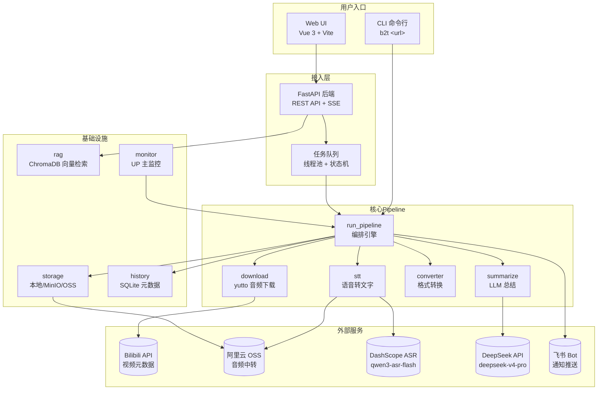
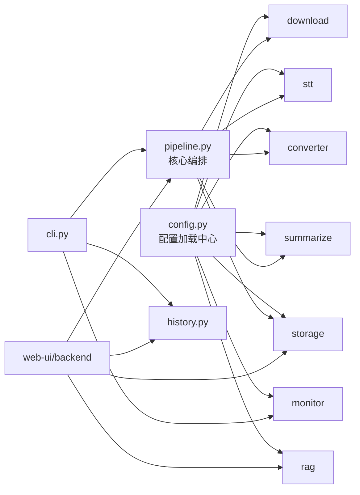

# 架构总览

## 系统分层

## 模块依赖关系

## 核心模块职责

| 模块 | 路径 | 一句话职责 |
|------|------|-----------|
| **配置中心** | `b2t/config.py` | TOML 加载、验证、dataclass 建模（31 个配置类） |
| **下载** | `b2t/download/` | 通过 yutto 下载 B站视频音频流，提取元数据和 BV 号 |
| **语音转写** | `b2t/stt/` | 多 provider 工厂：Qwen ASR / Groq Whisper / 火山引擎 |
| **存储** | `b2t/storage/` | 产物持久化：本地磁盘 / MinIO (S3) / 阿里云 OSS |
| **格式转换** | `b2t/converter/` | Markdown → TXT / PDF / PNG / HTML / 表格 PDF |
| **LLM 总结** | `b2t/summarize/` | LiteLLM 流式调用，preset 模板注入，markdownlint 格式化 |
| **RAG 检索** | `b2t/rag/` | ChromaDB 向量存储，Markdown 分块，LLM 问答 + 来源引用 |
| **UP 主监控** | `b2t/monitor/` | 定时检查动态 → 自动转录 → 飞书通知 |
| **历史记录** | `b2t/history.py` | SQLite 持久化转录元数据，支持分页搜索 |
| **CLI** | `b2t/cli.py` | 命令行入口 + Textual 交互模式 |
| **Web 后端** | `web-ui/backend/` | FastAPI REST + 8 个路由模块 + 任务队列 |
| **Web 前端** | `web-ui/frontend/` | Vue 3 SPA，4 个主页面 |

## 运行时模式

| 模式 | 环境变量 | API Key 来源 | 删除功能 | 适用场景 |
|------|----------|-------------|:--:|------|
| **default** | `B2T_WEB_UI_MODE=default`（默认） | `config.toml` | ✅ | 个人使用 |
| **open-public** | `B2T_WEB_UI_MODE=open-public` | 用户在前端自行填写 | ❌ | 公开演示 / 多用户 |
