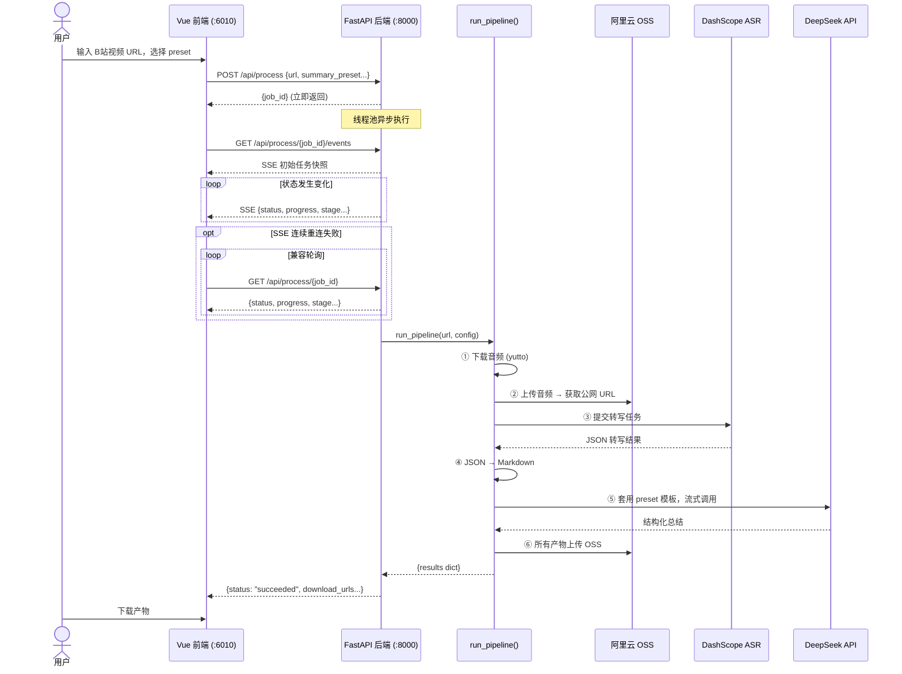
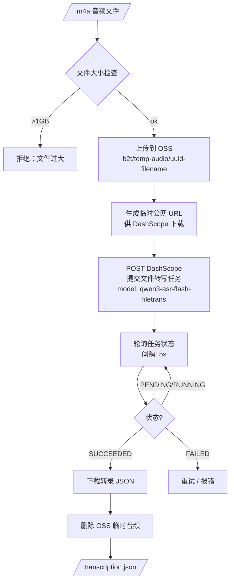
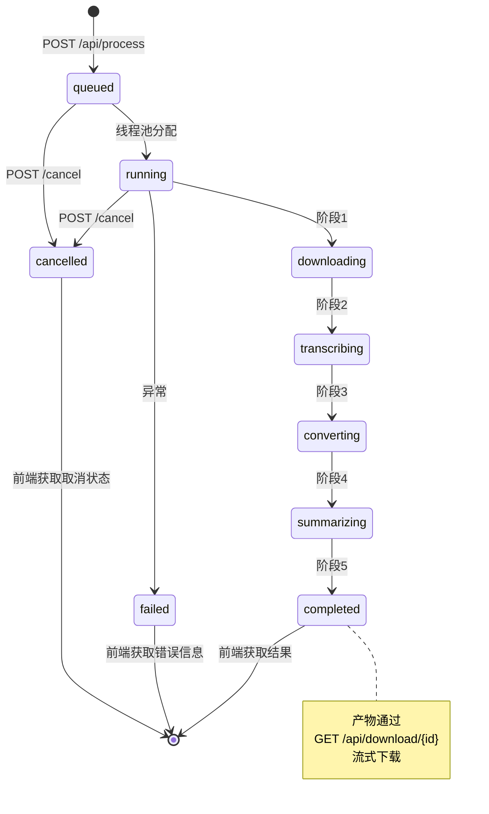
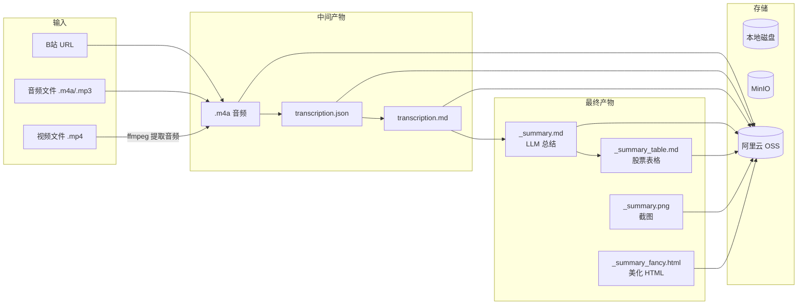

# Pipeline 工作流程

## 总体流程（用户视角）



## Pipeline 内部详细流程

```mermaid
flowchart TD
    START([用户输入 URL 或上传音频]) --> CHECK{audio_path?}

    CHECK -->|有本地音频| LOCAL[验证本地文件<br/>从文件名提取 BV 号]
    CHECK -->|无| DOWNLOAD[调用 yutto 下载音频<br/>extract_bvid 提取 BV 号]

    LOCAL --> WORKDIR[创建工作目录<br/>transcriptions/BVxxx_标题/]
    DOWNLOAD --> WORKDIR

    WORKDIR --> STT_STEP[步骤② 语音转文字]

    STT_STEP --> STT_TYPE{STT Provider?}

    STT_TYPE -->|Qwen ASR| QWEN[上传音频到 OSS<br/>获取临时公网 URL<br/>提交 DashScope 文件转写<br/>轮询任务状态<br/>下载转录 JSON]
    STT_TYPE -->|Groq Whisper| GROQ[本地音频分块<br/>逐块发送 Groq API<br/>合并重叠片段<br/>去重]
    STT_TYPE -->|火山引擎| VOLC[上传音频到 OSS<br/>submit → poll → result]

    QWEN --> JSON[得到 transcription.json]
    GROQ --> JSON
    VOLC --> JSON

    JSON --> MD_STEP[步骤③ JSON → Markdown]
    MD_STEP --> MD_DETAIL[解析各格式 JSON<br/>提取带时间戳句子<br/>合并短句 &lt;60 字符<br/>保存 .md 文件]

    MD_DETAIL --> SKIP{skip_summary?}

    SKIP -->|是| STORE[步骤⑤ 存储所有产物]
    SKIP -->|否| PRESET[步骤④ LLM 总结]

    PRESET --> RESOLVE[解析 preset 模板<br/>检查作者上下文 context.toml<br/>注入股票别名/主题词]
    RESOLVE --> PROMPT[构建 prompt =<br/>context_block + 转录正文 + template]
    PROMPT --> STREAM[LiteLLM 流式调用 LLM<br/>支持 bailian/deepseek/groq/openrouter]
    STREAM --> POST[后处理：降级标题<br/>注入视频元数据<br/>markdownlint 格式化]
    POST --> SAVE[保存 _summary.md]
    SAVE --> TABLE[提取末尾 Markdown 表格<br/>保存 _summary_table.md]

    TABLE --> STORE
    STORE --> OSS[上传到阿里云 OSS<br/>b2t/BVxxx-hex/filename]
    OSS --> DONE([返回 dict[str, StoredArtifact]])
```

## STT 语音转写详细流程（Qwen ASR）



## 总结 Prompt 构建流程

```mermaid
flowchart TD
    MD[/转录 Markdown/] --> READ[读取文件内容]

    META[VideoMetadata<br/>作者/标题/发布时间] --> CTX_MATCH{context.toml<br/>是否匹配到作者?}

    CTX_MATCH -->|是| CTX_INJECT[注入作者上下文<br/>股票池 / 别名映射 / 主题词]
    CTX_MATCH -->|否| SKIP_CTX[跳过上下文注入]

    CTX_INJECT --> CONTENT
    SKIP_CTX --> CONTENT

    READ --> CONTENT[合并: context_block + 转录正文]
    CONTENT --> TEMPLATE[套用 preset 模板<br/>{content} 占位符替换]

    TEMPLATE --> LLM_CALL[LiteLLM stream_completion<br/>api_base + api_key + model]
    LLM_CALL --> REASON[提取 reasoning_content<br/>（思维链输出）]
    LLM_CALL --> ANSWER[收集 content 字段]

    REASON --> LOG[打印推理过程到终端]
    ANSWER --> POST[post_process_summary_markdown:<br/>1. # 标题降级为 ##<br/>2. 添加元数据头部<br/>3. markdownlint 格式化]

    POST --> SAVE[/_summary.md/]
```

## Web 后端任务生命周期



## 数据对象流转



## RAG 检索流程

```mermaid
flowchart TD
    subgraph 索引（离线）
        IDX1[历史转录 Markdown/Summary] --> IDX2[chunk_markdown<br/>按段落分块<br/>800字符/100重叠]
        IDX2 --> IDX3[embed_texts<br/>LiteLLM 嵌入<br/>batch_size=10]
        IDX3 --> IDX4[(ChromaDB<br/>cosine 向量存储)]
    end

    subgraph 查询（在线）
        Q1[用户输入问题] --> Q2[embed_texts<br/>问题向量化]
        Q2 --> Q4[ChromaDB.query<br/>top-k 相似检索]
        Q4 --> Q5[构建 prompt:<br/>引用块 + 问题]
        Q5 --> Q6[LLM 生成回答<br/>带来源引用 [1][2]...]
        Q6 --> Q7[/RagAnswer<br/>answer + sources/]
    end

    IDX4 -.-> Q4
```
